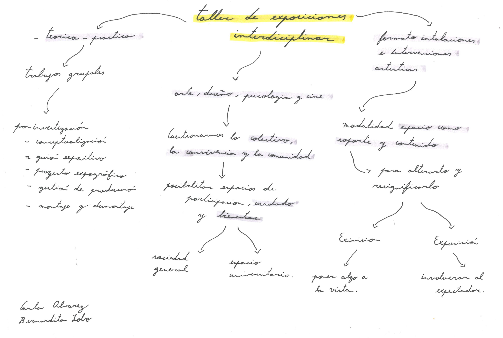
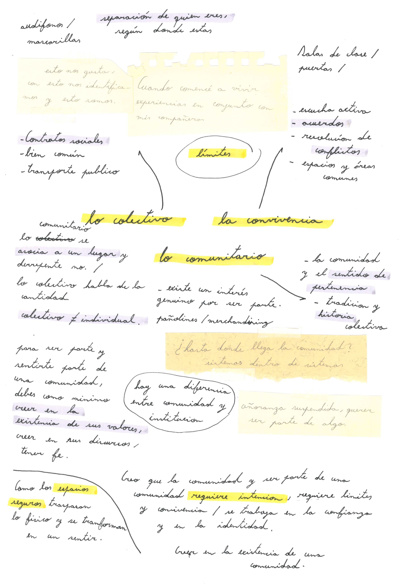

# Carpeta base

## Taller de exposiciones interdisciplinares / Segundo semestre, 2025

Bernardita Lobo / Estudiante de Diseño

### 1- ¿A quién te tocó presentar el 1er día de clases? 

- Benjamín Jofré Echaiz, 22 años

- Psicología, cuarto año

- Le interesa la rama de la psicología comunitaria, ya que le permite estar en contacto con las personas, identificar sus necesidades y aportar al fortalecimiento de las comunidades y sus territorios. Actualmente, ha estado colaborando y gestionando el grupo de disidencias sexogenéricas de la universidad, con el objetivo de generar una red de estudiantes pertenecientes a la comunidad LGBTIQANB+ y compartir experiencias.

- Tomó este curso con la intención de aprender a trabajar en conjunto con otras disciplinas, además de desarrollar una mirada distinta, como la que ofrecen las carreras artísticas.

### 2- Graficar el pensamiento que divaga. 

### 3- Gabinete de curiosidades. Trabajo en grupo

Bernardita Lobo,  June Maffioletti, Sofía Hernández, Vania Paredes.

#### A partir del ejercicio grupal Gabinete de Curiosidades que realizaron en clase, describa ¿Cuál fue la metodología para ponerse de acuerdo para realizar el ejercicio?

Comenzamos vinculando los objetos con las categorías a las que los habíamos asociado inicialmente, para luego conectarlos con palabras, frases o ideas relacionadas. En un primer momento lo hicimos de manera intuitiva, y después fuimos observando qué disposición funcionaba mejor en nuestra puesta en escena. El proceso fue pasando desde asociaciones semánticas, luego cromáticas, hasta finalmente relacionar los objetos con elementos del hogar. A partir de esa idea, comenzamos a reorganizarlos como si fueran parte de una mesa de comedor, dándoles movimiento y acciones para generar mayor dinamismo.

Posteriormente, llegamos a la conclusión de que lo más efectivo sería colocar primero solo los conceptos sobre la mesa, a modo de mapa guía. Esto nos permitió visualizar de mejor manera las conexiones entre categorías y, a partir de ahí, decidir dónde ubicar los objetos y cómo agruparlos para que tuvieran mayor coherencia. Durante todo el proceso fuimos conversando y evaluando las disposiciones que nos hacían más sentido, llegando a acuerdos colectivos sobre qué elementos debían ir juntos.

#### Luego de la lectura y análisis colectivo de su ejercicio, resuma ¿Cuáles creen que fueron los aciertos conceptuales y formales de su ejercicio y que mejorarían?

Nos gustó cómo la idea fue evolucionando desde algo más concreto e individual hacia una propuesta colectiva, donde los objetos se conectaban entre sí y parecían estar siendo utilizados. Logramos transformar la disposición en una escena activa, destacando especialmente la taza, la mandarina y las cartas, lo que consideramos un acierto. En cierto punto, la conjugación de los objetos transmitió un aspecto hogareño (tal como lo confirmaron luego nuestros receptores), por lo que nos centramos en reorganizarlos de manera que ese carácter cotidiano se hiciera evidente. También valoramos el hecho de que el nombre elegido reforzará y le diera sentido a la propuesta, lo que resultó satisfactorio.

Sin embargo, reconocemos que nos faltó tiempo para madurar y expandir más la escena. Por ejemplo, podríamos haber dispuesto las cartas en distintos lados de la mesa, simulando un juego entre varias personas, o bien explorar formas de darle mayor dimensión y dinamismo a los elementos. Además, si bien los objetos utilizados evocaban la idea de una mesa (con la taza y la mandarina como referentes), no supimos aprovechar plenamente la mesa en sí como un objeto más del gabinete de curiosidades. Creemos que darle ese protagonismo nos habría permitido potenciar la narrativa visual y enriquecer la experiencia.

### 4- Ampliando la investigación con el Círculo de Historias. Trabajo en grupo

Bernardita Lobo, June Maffioletti, Sofía Hernández, Vania Paredes.

#### ¿Puedes relatar una situación concreta donde te encontrabas en un momento dificil (crisis, ansiedad, estrés, etc) dentro de la Universidad? ¿Alguien te sostuvo o acompañó en dicha situación?

### Relatos

1- despues de dar un examen de oral en epistemología, me tocaron dos preguntas justo de los temas que no sabía mucho, me sentí tonto, humillado por la profesora, y sentí q no servía para mi carrera, fue un momento super dificil, salí llorando del examen, estuve mucho rato angustiado pensando en q me había echado el ramo, recuerdo q algunas amistades estaban fuera de la facultad y me contuve en esas personas, pero la verdad solo recuerdo con angustia ese momento.

2 - Claro yo vivi un momento en donde tuve que congelar un semestre en la universidad, obviamente eso me causo muchos problemas de ansiedad y estres, ya que fue algo que yo no tenia planeado (yo creo q nadie) y quedar en un "vacio" me causaba mucha ansiedad, debio a eso tuve que acudir a una psicologa que fue como la persona que me acompaño en ese momento.

3 - recuerdo esos tiempos con mucha ansiedad, entre vivir un duelo, el cambio de casa reciente, era mi primer semestre como ayudante y tenía mucho pánico con hablar frente a tantas personas, me disociaba al punto de tener la sensación de solo ser palabras sin cuerpo.
Tambien recuerdo que para la primera solemne de (asignatura) estudié 3 semanas con anticipación y el día anterior a la prueba estaba estudiando en grupo en la u, y con el cansancio arrastrado de esas semanas. Me tome sin receta una pastilla para la concentración y comencé a tener rumiaciones obsesivas horribles, pensamientos intrusivos que se sentían como un laberinto imposible de salir. Todos pararon de estudiar y me acompañaron fumando por un buen rato, y comprendí que el estudio sin pausas o descansos era inútil. La calma y el reposo son fundamentales para proveerse de la memoria, donde el aprendizaje exige esa condición. 

4 - Para mí, siempre han sido los profesores quienes me han sostenido. Los conocí en tercer año, justo cuando mi mamá tuvo que ser operada de urgencia. En ese momento decidí no acercarme demasiado a mis compañeros, pero encontré en mis docentes un espacio de apoyo y contención que me acompañó en medio de la crisis.

5 - Mi última experiencia fue en un taller, justo antes de congelar. Venía de una pésima vivencia en el trabajo en equipo: me culparon y responsabilizaron por la falta de avance, lo que me dejó sin ánimo para seguir. Me costaba adaptarme a un nuevo grupo, sobre todo en la comunicación y en sentirme acompañada. Finalmente no pude completar una entrega a tiempo y tomé la decisión de congelar. Recuerdo estar en la cafetería, escribiendo por WhatsApp a mi equipo, compartiendo el avance que ya no alcancé a hacer. Ellos me respondieron que estaba bien, pero que me había faltado comunicar más. En ese momento me di cuenta de que no tenía a nadie en quien apoyarme.

6 - Era el primer semestre de segundo año y debía entregar la solemne a las 12. Me dijeron que tenía que rehacer todo de nuevo y, además, quedarme en la sala trabajando sin parar. El profesor no ofrecía soluciones, solo agregaba problemas. En medio de la presión, fui al baño a llorar y luego volví a trabajar. No había nadie allí para acompañarme; me sentí completamente sola.

7 -Fue una situación bastante reciente donde estaba padeciendo de pensamientos sobre autolesiones, por suerte mi círculo de amistades me contuvieron y me apoyaron junto a mi familia, lamentablemente la institución académica no hizo nada porque no se encontraba nadie de las autoridades en el momento en el que yo quería poner una constancia sobre mi salud mental.

8 - Me pasó hace un año que, me dio una crisis en la sala de pintura de la FAAD, me contuvieron mis amigos hasta que llegó la paramédico, y luego una psicóloga que se demoró mucho en llegar, por eso me contuvo mi hermana que llegó luego de un rato gracias a mis amigos porque ellos la llamaron. Ya pasado el rato, la psicóloga que me vio en la Facultad me derivó al hospital Horwitz, el equipo de salud mental pagó el viaje de ida. 

#### Rescate una o dos frases de cada texto y organícelas en un listado a modo de poema o manifiesto.

### Poema tejido de relatos

1 -

2 -

3 - 

4 - encontró en sus docentes un espacio de apoyo y contención

5 - pésima vivencia en el trabajo en equipo / no tenía a nadie en quien apoyarse 

6 - no ofrecía soluciones, solo agregaba problemas / fue al baño a llorar y luego volvió a trabajar

7 -

8 -

9 -

10 -

11 -

12 -

### 5- La institucionalidad UDP y la convivencia. 

#### Dirección de Género

La irrupción del feminismo en la universidad
Video revisado en clase "Ola Feminista de mayo de 2018"

Ola feminista de mayo del 2018, se exige una educación no sexista, la importancia de que perdure una memoria colectiva, historia de las generaciones feministas, que se masifiquen las voces.
El feminismo es la práctica histórica del movimiento de mujeres contra la discriminación sexual, reinterpretar las bases epistemológicas, cuestionar la imparcialidad.

Demandas feministas y su institucionalidad: erradicar la violencia sexual y discriminación, con normativas y políticas; una educación no sexista y ver si existe una paridad estructural, paridad en los roles de decisión.

La cultura de la cancelación. Se busca controlar, sancionar y excluir. No se logran resolver conflictos, solo se reproducen desigualdades.

#### ¿Qué impacto ha tenido en nuestras experiencias cotidianas el feminismo, género en relación a universidad?

En mi caso, mi experiencia con la comunidad universitaria y el feminismo ha sido bastante variada. Por un lado, con mis compañeres siempre me he sentido cómoda en los espacios que habito dentro de la universidad, incluso libre. Ha sido un entorno donde puedo expresarme sin sentirme juzgada, lo cual valoro profundamente. En particular, en la comunidad de la FAAD, las personas que coexistimos somos muy diversas, y creo que, rescatando lo hablado en clases anteriores, esto se debe a que hemos aprendido a convivir marcando límites y comunicándonos.

Sin embargo, también he vivido experiencias menos positivas, especialmente con algunos profesores que claramente no están familiarizados con el feminismo. En ocasiones, han hecho comentarios incómodos y cosificadores, marcando una fuerte diferencia entre profesor y alumno o han interrumpido conversaciones de manera inapropiada.

Más que una simple diferencia de roles, que considero válida y necesaria en ciertos contextos, lo que percibía en sus discursos era una tendencia a encasillarnos, ya fuera por género o por nivel socioeconómico. Esta forma de relacionarse generaba una sensación de deshumanización, donde no había empatía hacia quienes ocupábamos otras posiciones dentro de la universidad.  Esa falta de reconocimiento del otro como sujeto generaba una sensación de distancia, haciendo difícil sentirme parte de una verdadera comunidad universitaria. parecía que esa misma comunidad que debería incluirnos, en realidad nos estaba excluyendo.

#### ¿Qué es un lugar seguro?

Un lugar seguro tiene que ser como un colchón en donde puedas caer. Ser vulnerable, ya que sentirse seguro es un acto de confianza. Un lugar seguro puede ser físico o una construcción emocional; es un vínculo. Sentirse seguro es un acto consciente que parte del reconocimiento.

#### Departamento de Salud Mental
