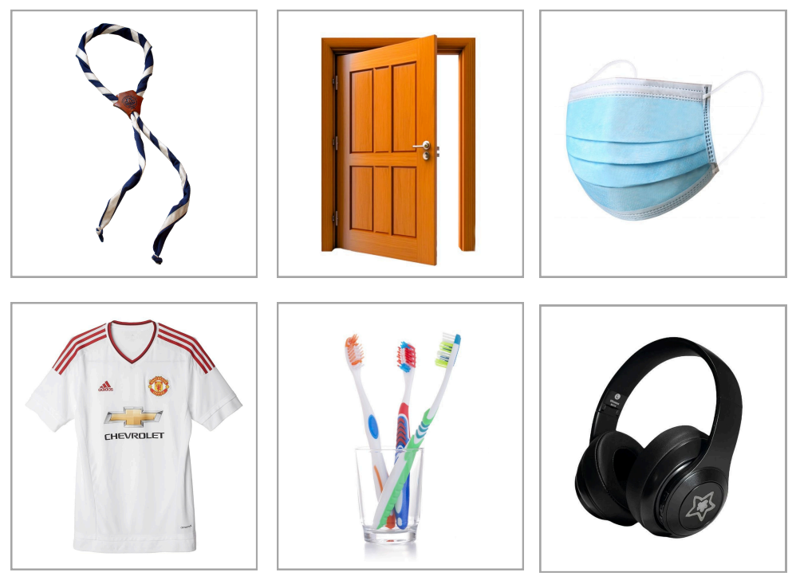

# La comunidad – Lo colectivo – La convivencia

Trabajo en clase / Martes 05 de agosto, 2025

## Encargo

### La comunidad – Lo colectivo – La convivencia

#### Desarrollo de el encargo

Elaborar un listado de por lo menos diez términos o frases cortas asociadas a cada uno de los conceptos, pueden ser sinónimos, situaciones, expresiones entre otras posibilidades.

Traer 3 objetos (cosas de cualquier tipo ) asociados a los listados de cada uno de los conceptos. (6 objetos en total) Los objetos se usaran para un ejercicio colectivo.

Nos preguntaremos por estos conceptos y por las condiciones estructurales que posibilitan los espacios de participación, cuidado mutuo y bienestar, tanto de la sociedad en general como en la convivencia en nuestra Universidad. 

#### Asigancion de espacios

Para cada área decidí ubicarla en un espacio específico que yo habito.

Para el concepto de comunidad, elegí el espacio de scout, ya que siento que está muy ligado a la identidad y la tradición.

Para el concepto de colectivo, lo ubiqué en el transporte público y en las zonas públicas, porque representan el uso compartido y la interacción constante entre personas que no necesariamente se conocen, pero que colaboran en un mismo sistema.

Para el concepto de convivencia, decidí elegir mi casa y los espacios donde he residido, ya que ahí se ponen en práctica el respeto, los acuerdos y la vida compartida en lo rutinario.

### La comunidad 

Sentido de pertenencia, tradición, objetivos comunes e historia colectiva. Sus miembros muestran un interés genuino por ser parte, comparten valores morales y participan activamente, lo que les otorga un valor significativo el formar parte de ella. Un ejemplo de este tipo de comunidad son los Scouts.

#### Si tuviera que atribuirle dos objetos serian:

Pañolín: representa la identidad, el compromiso y el sentido de pertenencia dentro de la comunidad scout. Es un símbolo visible de unión, orgullo y trayectoria compartida.

Logos: comunican los valores, la misión y la historia de la comunidad. Funcionan como lenguaje visual común que fortalece la identidad grupal.

Merchandising: son elementos que fortalecen la cultura compartida y permiten expresar orgullo y adhesión al grupo.

### Lo colectivo 

Lo colectivo se relaciona con el bienestar común y los contratos sociales que regulan la convivencia. Existe una cultura intrínseca que, a veces, genera separación entre quién eres y el lugar en que estás, fragmentando lo que eres. En estas situaciones, lo incómodo se hace notar y se requiere un salto de fe para pedir o recibir ayuda, confiando en un “buen otro”. En espacios colectivos como el transporte público, o te integras y formas parte de la dinámica, o puedes incomodar, hay que esforzarse por funcionar y pasar desapercibido.

#### Si tuviera que atribuirle dos objetos serian: 

- Audífonos: símbolo de la desconexión individual dentro del espacio común; una manera de respetar el silencio y el espacio del otro, y de seguir los contratos sociales implícitos.

- Mascarillas: además de ser un elemento utilizado a nivel mundial durante la pandemia, una experiencia colectiva que todos tuvimos que atravesar y resistir a nuestra manera; también pueden entenderse como un gesto hacia el otro, una forma de cuidado, una precaución para no enfermar ni incomodar a los demás.

### La convivencia 

La convivencia en los espacios donde he residido se basa en la escucha activa, la comunicación y los acuerdos entre sus miembros. Implica la resolución de conflictos y el cuidado de los espacios y áreas comunes, así como entender y respetar al otro por lo que es. También requiere establecer y respetar límites para que la vida compartida funcione de manera armoniosa.

#### Si tuviera que atribuirle dos objetos serian: 

Puerta: representa la entrada al espacio común, la confianza y también la necesidad de respetar los tiempos e intimidad del otro. Por ejemplo, en la universidad, cuando llegamos tarde, entendemos de forma implícita que si una puerta está cerrada, hay que entrar con cautela; preguntando, en silencio o, a veces, simplemente no entrando. Es un límite físico que también comunica normas de convivencia no dichas.

Cepillo de dientes: símbolo de lo personal en un espacio compartido. Aunque todos los cepillos están en el mismo lugar; por ejemplo, en un vaso común en el baño, cada persona usa únicamente el suyo. Este objeto cotidiano refleja la necesidad de acuerdos sobre higiene y el respeto por los límites de lo íntimo dentro de la convivencia.

