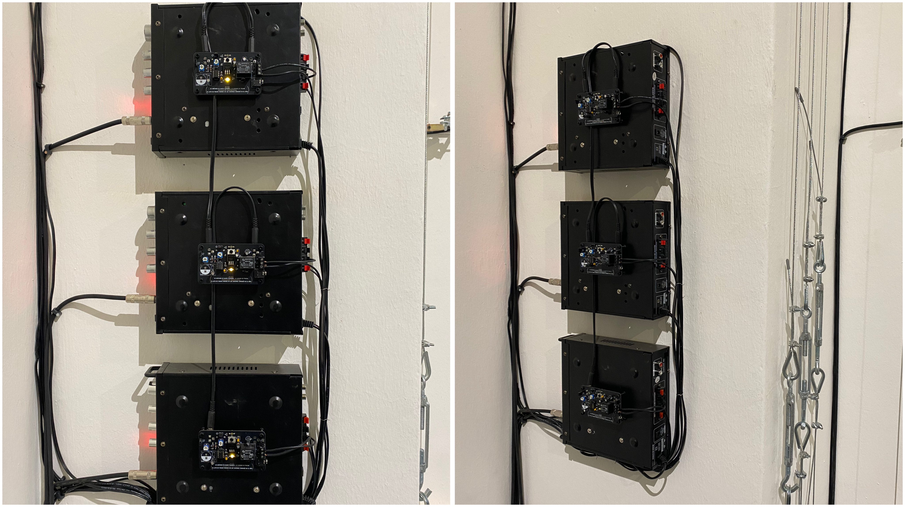
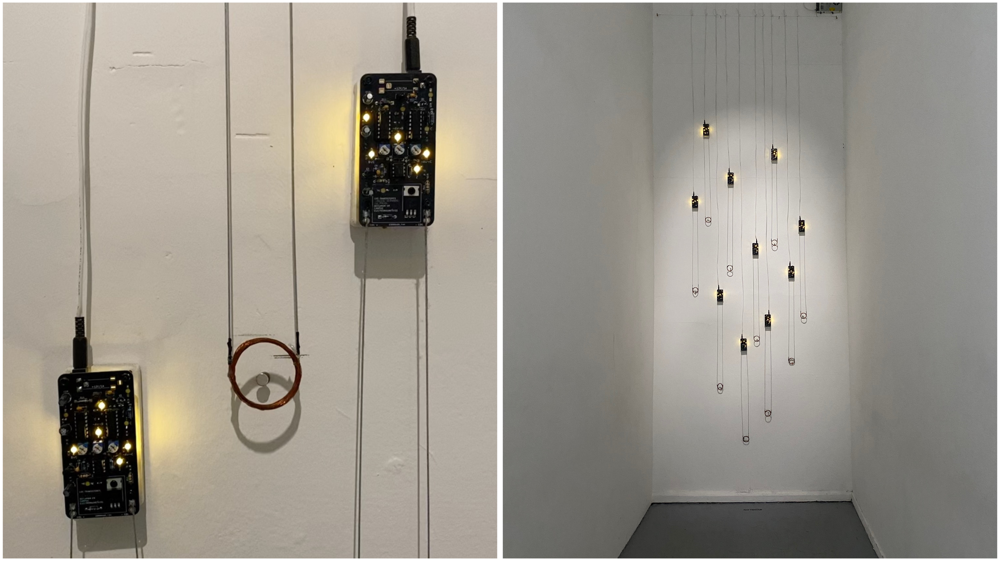

# Visita al MAC

Martes 02 de septiembre, 2025.

### Obras

01- Matías serrano 

“Un trazo en el oído” - Intervención

02- Matías serrano 

“Transistores en tránsito” - Instalación

03- Mónica Bate

“Dust: un sentido temporal” - Instalación

04- Jorge Cabieses Valdés

“Síndrome de ménière” - Intervención 

05- Rainer Krause 

“Objetos pesados cayéndose” - Captcha piece - Instalación

06- Francisco Sanfuentes

“Sonidos de otro lugar” - Instalación 

07- Lucas Soffia 

“MAC QN Echo Chamber” - Intervención 

### Lectura performativa

Paola propone una suerte de recorrido guiado. 

Escuchar en el encuentro, decantar en la escritura. La voz no solo transmite, también transforma. La escritura se vuelve a verbalizar. 

Hay una atención especial a las señalogías de las palabras, es importante ver de dónde vienen, qué solicitan, qué requieren los contextos.

Nucleo arte sonoras, intervensiones de artes sonoras

Los artistas, curadores y docentes de la Universidad de Chile se consideran una agrupación, aunque no un colectivo.

Cada uno se aproxima, desde sus propios trabajos, a ciertas temáticas.

La lectura performativa le dio más profundidad a las obras. En las visitas guiadas y los discursos suele primar una mediación desde la neutralidad. A ella le interesa más dar un punto de vista evidente.

El relato es una sombra que busca entender lo oculto, los secretos y las motivaciones. Desde lo cotidiano, los procesos, la vida… por qué tomaste esas decisiones, cuán personales son las obras.

Secreto, secreta. Se externaliza, como si la creación se desbordara. 

Hay cosas que quedaron fuera. El hecho de que la institución no ve que los artistas trabajan en otras cosas, que no descansan, que trabajan para poder trabajar.

Está la institucionalidad del arte, y también la del saber. La institución no como espacio educativo, sino como etiqueta, como forma de encasillar. 

Es interesante cómo el artista trabaja con esa institucionalidad, con sus restricciones, sus bordes. 

Entre el artista y el espectador está la obra. La obra como punto de encuentro, como espacio compartido, como tensión entre lo que se muestra y lo que se interpreta.

## Encargo

Traer un zapato
